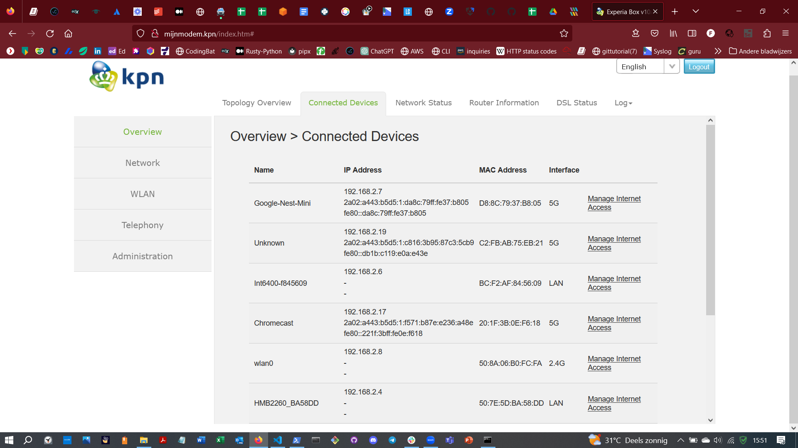
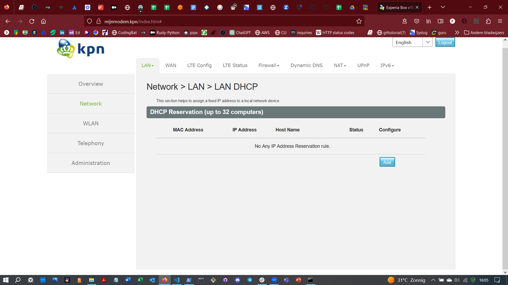

## NETWORK DEVICES:

In simple terms, a network device is a physical device that is used to connect other physical devices on a network.  
In some cases, their role is to simply forward packets of information to a destination.  
In other cases, it might be to serve as a translator or to block suspicious network traffic.

## KEY-TERMS

* Network Devices = devices that interconnect network traffic
* DHCP-server = dynamic host control protocol
* LAN = local area network

## study:
* Network devices.
* How these devices relate to the OSI model.

## ASSIGNMENT:

* Name and describe the functions of common network equipment.
* Most routers have an overview of connected devices, find this list.  
  Which other information does the router have about connected devices?
* Where does your DHCP server reside on your network? How is it configured?

## USED RESOURCES:

[network-devices](https://www.lepide.com/blog/the-most-common-types-of-network-devices/)

[router-login](http://mijnmodem.kpn/login.htm)

## DIFFICULTIES:

None

## RESULT:

## Common network devices and their functions:

### Hubs:

Hubs are used to connect multiple network devices together. They can be used to transmit both digital and analog information. Digital information is transmitted as packets, whereas analog information is transmitted as a signal. Hubs also act as a repeater, which amplifies signals that have weakened after being transmitted across a long distance.  

Hubs operate at the OSI layer 1 (Physical layer).

### Switch:

A switch is a multiport network device whose purpose is to improve network efficiency and improve communication between hubs, routers, and other network devices. Switches are intelligent devices that gather information from incoming packets in order to forward them to the appropriate destination. Switches generally have limited information about the other nodes on the network.  

Network switches can operate at either OSI layer 2 (Data link layer) or layer 3 (Network layer).

### Router:

The main role of the router is to forward packets of information to their destinations. Routers are more intelligent than hubs or switches as they store information about the other network devices they are connected to. Routers can play an important role in network security, as they can be configured to serve as packet-filtering firewalls and reference access control lists (ACLs) when forwarding packets. In addition to filtering authorized network traffic, they also are used to divide networks into subnetworks, thus facilitating a zero-trust architecture.  

Routers operate at the 0SI layer 3 (Network layer).

### Bridge:

A bridge is used to connect hosts or network segments together. As with routers, they can be used to divide larger networks into smaller ones, by sitting between network devices and regulating the flow of traffic. A bridge also has the ability to filter packets of data, known as frames, before they are forwarded. Bridges are not as popular as they once were, and are now being replaced by switches, which provide better functionality.  

Bridges operate at the OSI layer 2 (Data link layer).

### Gateway:

A gateway device is used to facilitate interoperability between different technologies such as Open System Interconnection (OSI) and Transmission Control Protocol/Internet Protocol (TCP/IP). In other words, they translate each other’s messages. You could think of a gateway as a router, but with added translation functionality.  

Gateways operate at the OSI layer 3 (Network layer)

### Repeater:

A repeater is a relatively simple network device that amplifies the signal it receives in order to allow it to cover a longer distance. Repeaters work on the Physical layer of the OSI model.  

Repeaters operate at the 0SI layer 1 (Physical layer)

### Access Point:

An access point (AP) is a network device that is similar to a router, only it has its own built-in antenna, transmitter and adapter. An AP can be used to connect a variety of network devices together, including both wired and wireless devices. Access points can be fat or thin. A fat AP must be manually configured with network and security settings, whereas a thin AP can be configured and monitored remotely.

Access Points operate at the 0SI layer 1 (Physical layer) or layer 2 (Data link layer)

## Overview of connected devices.

## More info on connected devices.

[dhcp-log_devices](../00_includes/SCREENSHOTS/Networking/NTW-1.2-DHCP-LOG.png) 

## My LAN DHCP server resides in my modem.

* It is not configured.

