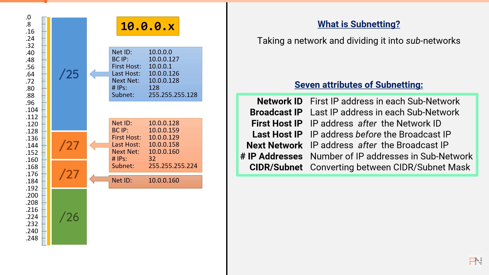
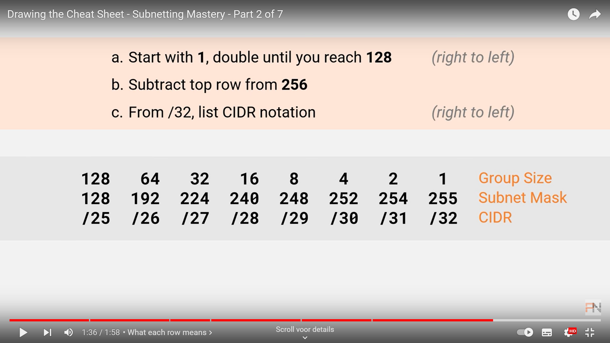

## SUBNETTING:

Subnetting is taking a network and dividing it into _sub_-networks.  
Subnetting makes network routing much more efficient.

## KEY-TERMS:

* SUBNETMASK = A subnetmask is a binary number that is used for subnet IP addressing in a network and difining the size of the subnet.
* CIDR notation = Classless Inter-domain Routing. Defines the size of the subnet.  
* VLSM = Variable Length Subnet Mask 
* VLSM and CIDR are two components of the same mechanism that allows an efficient partitioning of the IP addressing space.   
* NAT gateway = NAT Gateway (NGW) allows instances with no public IPs to access the internet.  
* Internet gateway = Internet Gateway (IGW) allows instances with public IPs to access the internet.  
   

## ASSIGNMENT:

### Create a network architecture that meets the following demands:  
* 1 private subnet that is accessable only from within the LAN. This subnet must be able to accommodate at least 15 hosts.
* 1 private subnet that has internet accesss via a NAT gateway. This subnet must be able to accommodate at least 30 hosts besides the NAT gateway.  
* 1 public subnet with internet gateway. This subnet must be able to accommodate at least 5 hosts besides the internet gateway.   

### Place the architecture you've made, with a brief explanation, in the shared repo with the learning coach.  

## USED RESOURCES:

[subnetting-mastery](https://www.practicalnetworking.net/stand-alone/subnetting-mastery/)

[Howto-Design-a-Basic-Subnet](https://www.youtube.com/watch?v=SBYNeGIng6I)

## DIFFICULTIES:

A lot of information to cover to be able to understand how subnetting works.

## RESULT:

**An IPv4 address beginning with any of the following is a private address:**  
* 10.x
* 172.16., 172.17., 172.18, etc up to 172.30. and 172.31.  
* 192.168.  

**Otherwise it’s a public IPv4 address (with a few minor exceptions)**

### Network Architecture:

**Explanation:**

A /25 network divided into:  
One /26 private subnet to accommodate:
  * A NAT gateway and a minimal of 30 Hosts.  
  
Two /27 subnets to accommodate respectively:
  * 1 private subnet that is accessable only from within the LAN and can accommodate a minimal of 15 Hosts.     
  * 1 public subnet with internet gateway which can accommodate a minimal of 5 Hosts.  

If there's a gateway present, the first available subnet entry is assigned to it for best practices.

