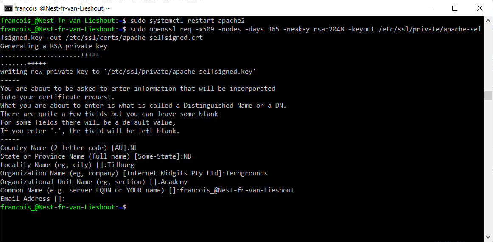
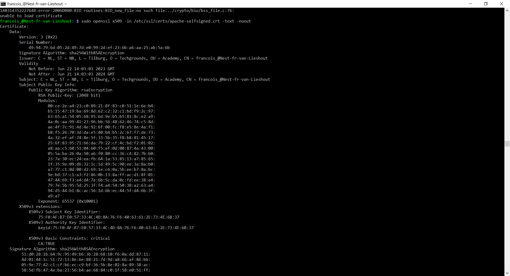
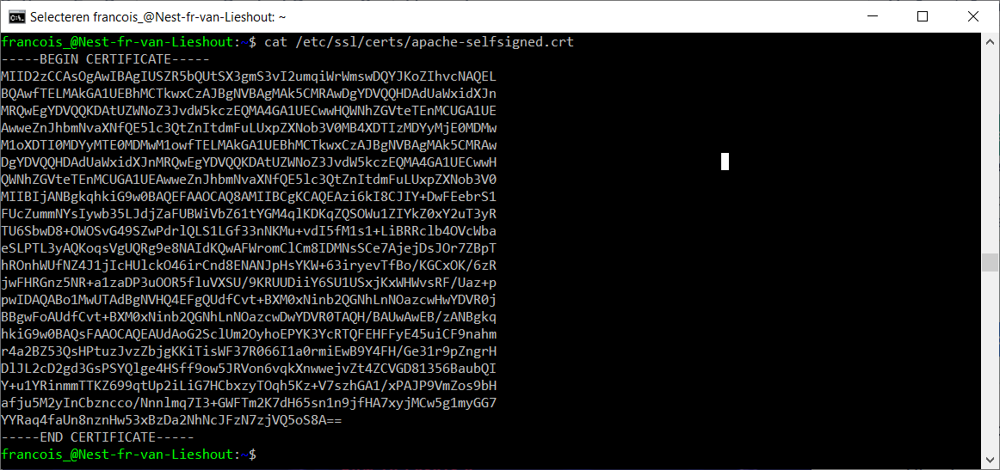
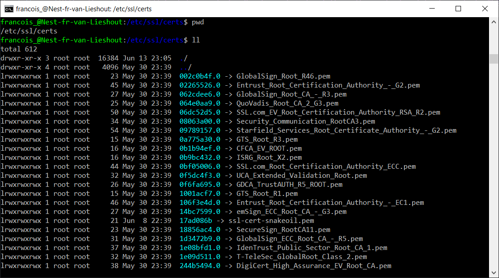

## TITEL:

Public Key Infrastructure (PKI) is a set of roles, policies, hardware, software and procedures needed to  
create, manage, distribute, use, store and revoke digital certificates and manage public-key encryption.  
It consists of three entities that assure you can communicate securely over an insecure network like the public internet.  

## KEY-TERMS:

* SSL = Secure Socket Layer
* TLS = Transport Layer Security

## ASSIGNMENT:

* Create a self-signed certificate on your VM.  
* Analyze some certification paths of known websites (ex. techgrounds.nl / google.com / ing.nl).  
* Find the list of trusted certificate roots on your system (bonus points if you also find it in your VM).  

## USED RESOURCES:

[installing-ssl](https://www.atlantic.net/dedicated-server-hosting/how-to-create-and-install-a-self-signed-ssl-certificate-on-ubuntu-20-04/)

[openssl-quick-ref](https://www.digicert.com/kb/ssl-support/openssl-quick-reference-guide.htm)

[self-signed-certificate-for-apache](https://www.digitalocean.com/community/tutorials/how-to-create-a-self-signed-ssl-certificate-for-apache-in-ubuntu-20-04)
## DIFFICULTIES:

* creating the certificate, it took a while before i found the right manual for apache.

## RESULT:

### Create a self-signed certificate:
 

#### Trusted certificate roots list.

